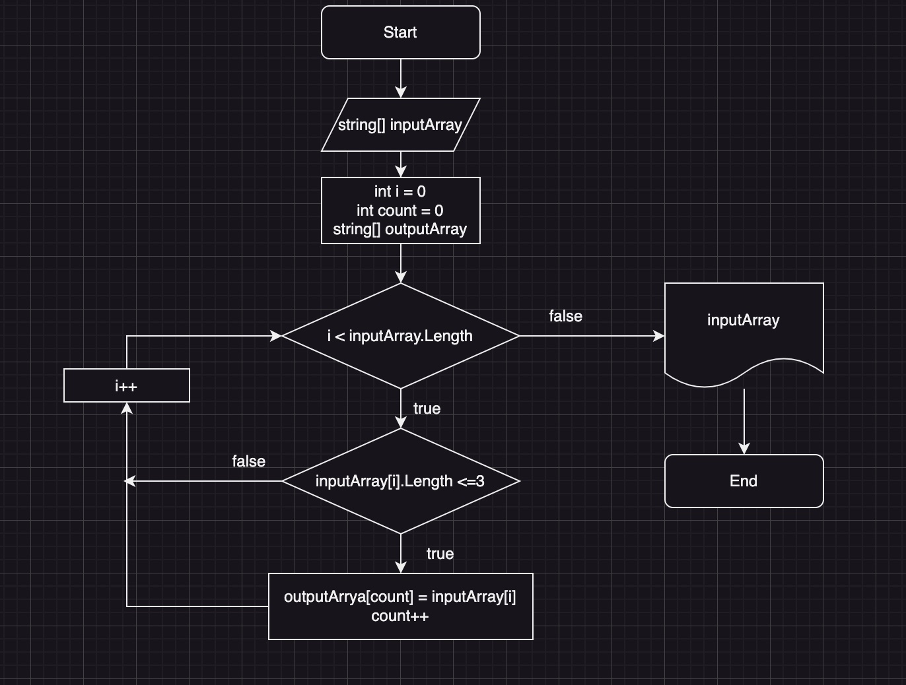

# Итоговая контрольная работа по C#

## Задача: 
Написать программу, которая из имеющегося массива строк формирует новый массив из строк, длина которых меньше, либо равна 3 символам. Первоначальный массив можно ввести с клавиатуры, либо задать на старте выполнения алгоритма. При решении не рекомендуется пользоваться коллекциями, лучше обойтись исключительно массивами.

## Описание алгоритма:
Пользователь вводит элементы массива. С помощью метода *CountElementsLongerThree* мы опрделям количество элементов, длинна которых меньше или равна трем и формируем итоговый массив с помощью метода *GetOutputArray*

В репозиторий добавлен файл *BlockDiagram.jpg* в котором составлен алгоритм составления итогового массива
